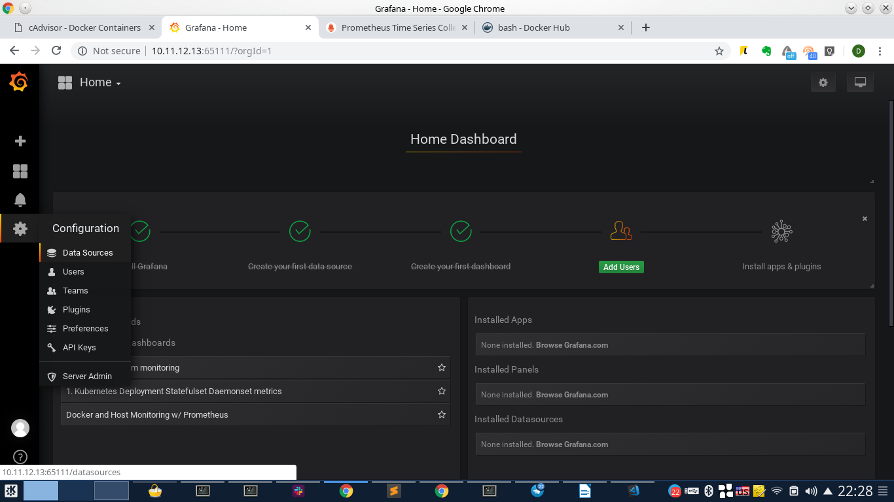
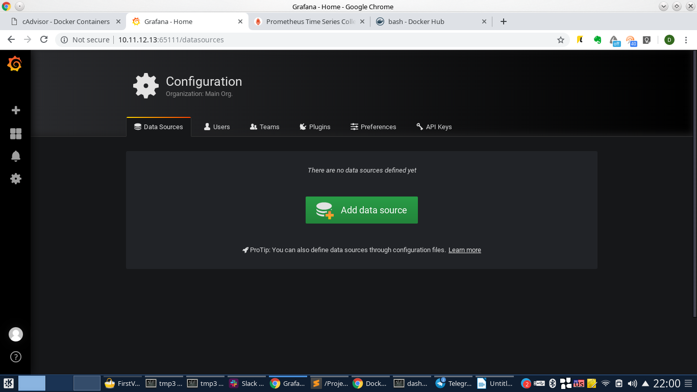
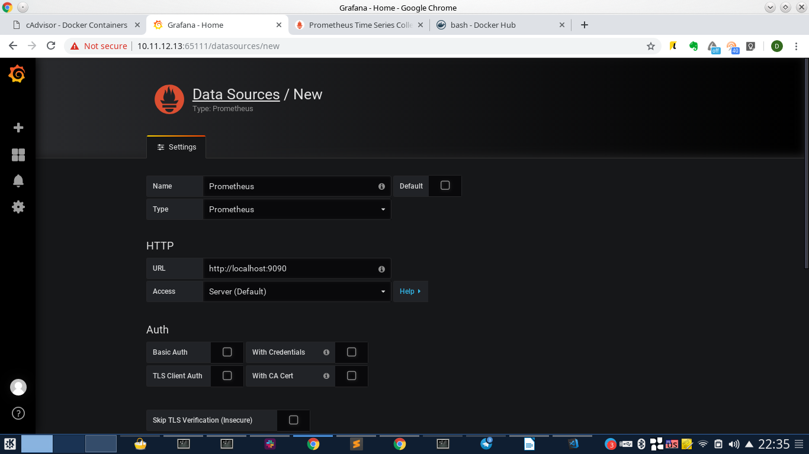
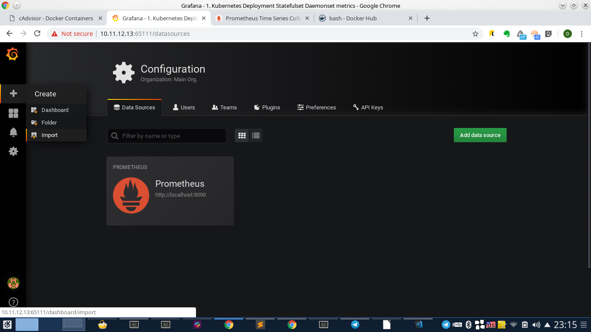
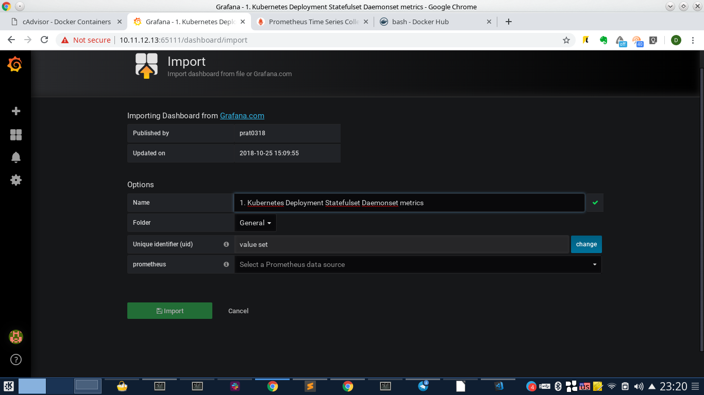
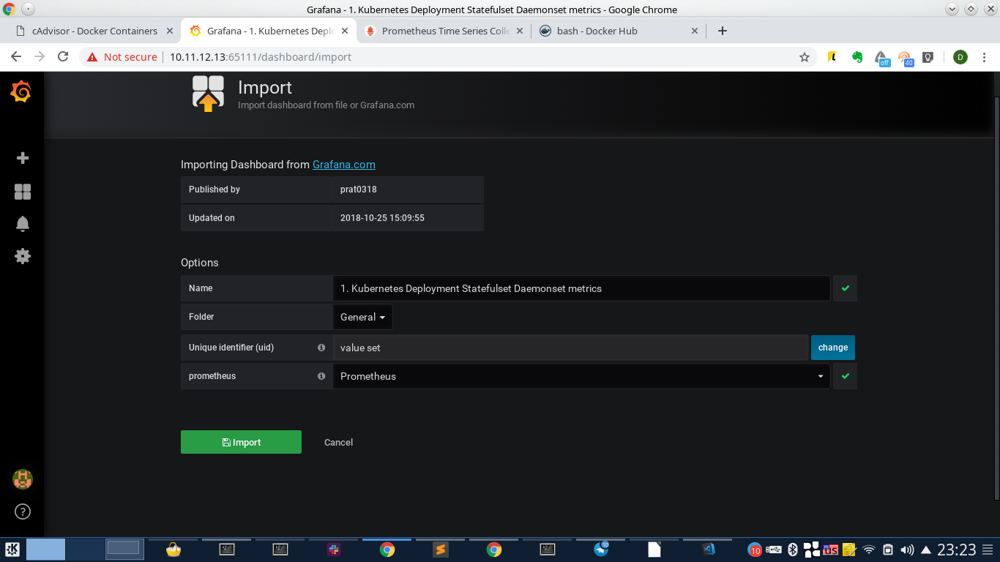
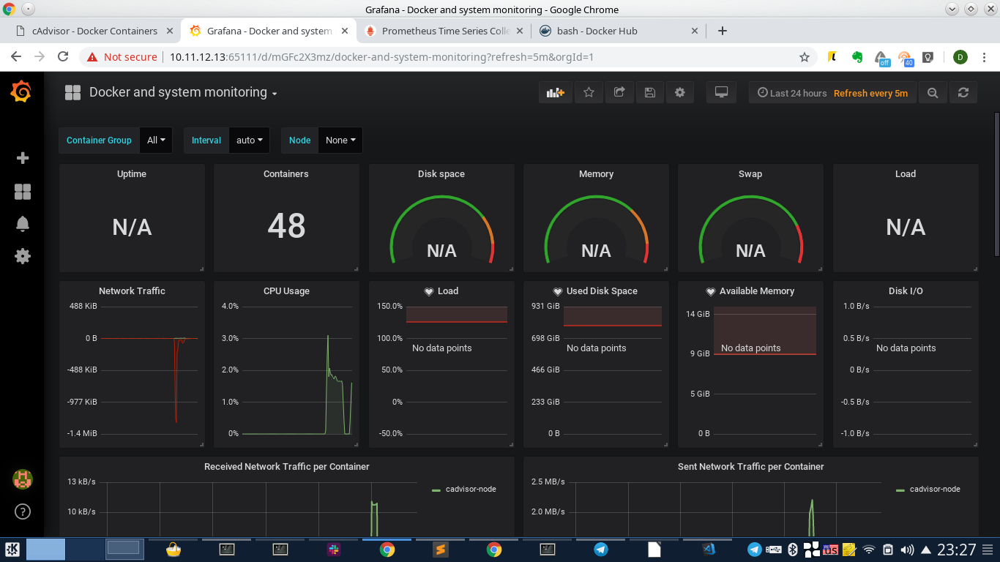
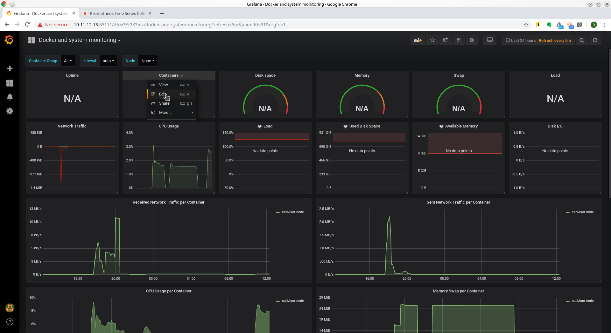

# Prometheus

## Подключаем хосты

При установке Prometheus через плейбук (prometheus-node) inventory содержит следующий фрагмент:
```
# Host for monitoring with cadvisor
      cadvisor_targets:
        - 127.0.0.1:
          name:
            monitoring
        - 147.135.4.123:
          name:
            swarm-us-1
        - 217.182.166.215:
          name:
            swarm-eu-1
        - 176.9.107.98:
          name:
            swarm-eu-2
        - 173.249.26.11:
          name:
            swarm-reserve
```
Рассмотрим его подробнее.
 - ```cadvisor-target``` - указывает, что на указанных хостах мы будем собирать данные от cAdvisor.
 - описание хоста. Состоит из нескольких строк. Формат важен. Построчное описание выглядит так: 1 строка - IP-адрес хоста, который будет опрошен; 2 строка - ключевое слово name; 3 строка - имя хоста. Под этим, более удобным именем, хост будет виден в Prometheus или Grafana.
```
        - 147.135.4.123:
          name:
            swarm-us-1
```

# Grafana

## Создание DataSource

После залогинования в Grafana необходимо подключить Datasource. Из него она будет брать данные для отображения. Для этого идем в настройки и выбираем DataSources

Получим следующую страницу:

Здесь нужно нажать на ```Add data source```
Переходим на следующую страницу. Если на ней выставляем тип (Type) prometheus, Задаем произвольное имя (в данном случае Prometheus) и адрес подключения (http://127.0.0.1:9090). Образец на картинке ниже.

После чего нажимаем ```save & test```
Если получаем на зеленом фоне ```Data source is working```, то все в порядке и можно переходить к созданию Dashboard.

## Импорт Dashboard

Идем в настройки и выбирает Import


В поле, обозначенном, ```Grafana.com Dashboard``` вводим 893 и клацаем в произвольном месте. Графана сама подтянет из коллекции готовый dashboard. Получим следующий экран:


В выпадающем списке prometheus выберем Datasource, созданный на предыдущем этапе

И нажимаем ```Import```

Получим следующий dashboard


## Редактирование графиков

На скриншоте выше счетчик ```containers``` имеет явно завышенное значение. Исправим это. Для этого наведем курсор на заголовок. Справа появится индикатор выпадающего меню, нажмем на него и выберем ```Edit```. Как показано на следующем скриншоте



