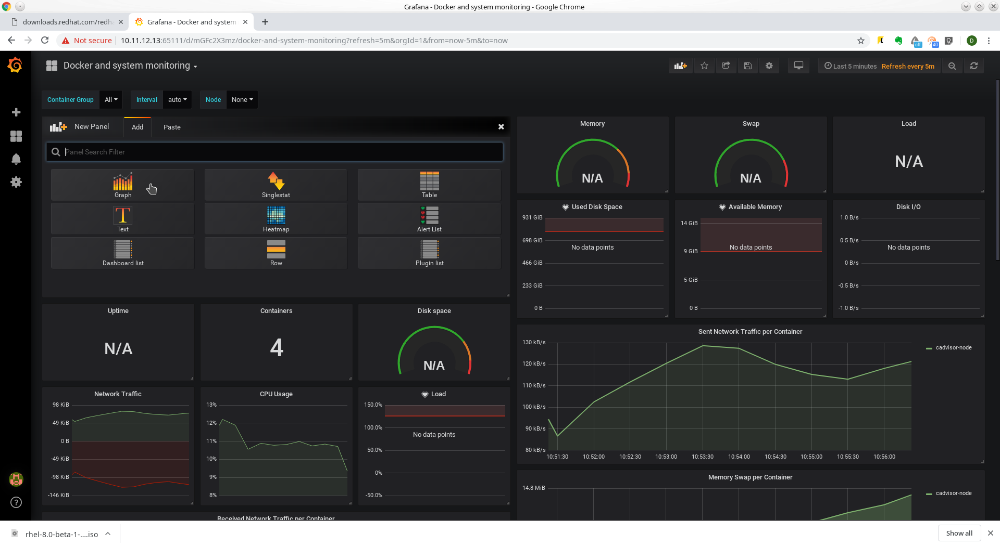

# Prometheus

## Подключаем хосты

При установке Prometheus через плейбук (prometheus-node) inventory содержит следующий фрагмент:
```
# Host for monitoring with cadvisor
      cadvisor_targets:
        - 127.0.0.1:
          name:
            monitoring
        - 147.135.4.123:
          name:
            swarm-us-1
        - 217.182.166.215:
          name:
            swarm-eu-1
        - 176.9.107.98:
          name:
            swarm-eu-2
        - 173.249.26.11:
          name:
            swarm-reserve
```
Рассмотрим его подробнее.
 - ```cadvisor-target``` - указывает, что на указанных хостах мы будем собирать данные от cAdvisor.
 - описание хоста. Состоит из нескольких строк. Формат важен. Построчное описание выглядит так: 1 строка - IP-адрес хоста, который будет опрошен; 2 строка - ключевое слово name; 3 строка - имя хоста. Под этим, более удобным именем, хост будет виден в Prometheus или Grafana.
```
        - 147.135.4.123:
          name:
            swarm-us-1
```

# Grafana

## Создание DataSource

После залогинования в Grafana необходимо подключить Datasource. Из него она будет брать данные для отображения. Для этого идем в настройки и выбираем DataSources

Получим следующую страницу:

Здесь нужно нажать на ```Add data source```
Переходим на следующую страницу. Если на ней выставляем тип (Type) prometheus, Задаем произвольное имя (в данном случае Prometheus) и адрес подключения (http://127.0.0.1:9090). Образец на картинке ниже.

После чего нажимаем ```save & test```
Если получаем на зеленом фоне ```Data source is working```, то все в порядке и можно переходить к созданию Dashboard.

## Импорт Dashboard

Идем в настройки и выбирает Import


В поле, обозначенном, ```Grafana.com Dashboard``` вводим 893 и клацаем в произвольном месте. Графана сама подтянет из коллекции готовый dashboard. Получим следующий экран:


В выпадающем списке prometheus выберем Datasource, созданный на предыдущем этапе

И нажимаем ```Import```

Получим следующий dashboard


## Редактирование графиков

На скриншоте выше счетчик ```containers``` имеет явно завышенное значение. Исправим это. Для этого наведем курсор на заголовок. Справа появится индикатор выпадающего меню, нажмем на него и выберем ```Edit```. Как показано на следующем скриншоте


После этого мы получим возможность изменить запрос для счетчика

Сам запрос находится в строке, где стоит курсор
Изменим запрос, вместо ```name```, напишем ```exported_name```. Запрос примет вид ```count(rate(container_last_seen{exported_name=~".+"}[$interval]))```
Убрав фокус с поля ввода, увидим, как изменится значение на более актуальное. Нажав на ```back to dashboard``` (верхний правый угол, стрелка назад) вернемся снова к dashboard'у. Он примет вид:


## Добавление графиков.
В процессе работы может возникнуть необходимость знать как менялось количество контейнеров во времени. Это позволит увидеть, к примеру, что был перезапуск контейнера.
Начнем с того что, добавим к нашему стенду контейнеров. К примеру, выполнив в консоли машины с докером ```docker run --rm bash:latest ping 8.8.8.8&```
Таким образом мы получим 2 контейнера (контейнер с командой ```ping``` и контейнер с ```cAdvisor```). Теперь приступим к добавлению элемента dashboard'а.
Нажмем на ```Add panel``` (видно на скриншоте)

Поскольку мы добавляем график, то его и выберем

У нас появится новая панель, с заголовком ```Panel Title```. Перейдем в режим редактирования. Теперь нам нужно указать источник данных (```Data source```). После чего появится поле для ввода запроса. Сам запрос можно взять из предыдущего примера. Он пойдет без изменений.
Теперь наш экран примет вид:

Переключимся на закладку ```General``` и укажем необходимое нам имя графика ```Containers count```

И выйдем из редактирования панели (стрелка вверху справа).
Теперь убьем ранее созданный контейнер с ping'ом. И подождем. Через некоторое время на графике отобразится изменение количества контейнеров.

А теперь для эксперимента запустим еще 2 контейнера с ping'ами. И понаблюдаем за изменением.

На скриншоте видно, как менялось во времени количество контейнеров.

Вернемся к режиму ипорта dashboard'а.

В нем нажмем зеленую кнопку ```Import .json file``` и выберем для импорта файл demo.json, который прилагается к инструкции. После чего нажмем кнопку ```Import```. После чего мы увидим загруженный нами dashboard.


Отдельные его элементы были созданы в примерах выше. Остальные можно рассмотреть в качестве примеров.
